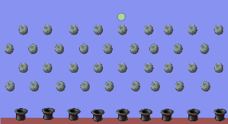
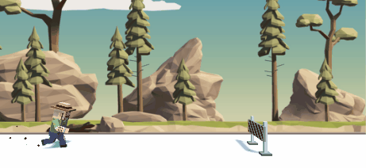

# Unity Playground

## Examples

|Project|Screen|
|:---:|:---:|
|Introduction to Audio||
|Real-time 2D||
|Programmer Pathway - Prototype 1||
|Programmer Pathway - Prototype 1 (Challenge)||
|Programmer Pathway - Prototype 2||
|Programmer Pathway - Prototype 2 (Challenge)||
|Programmer Pathway - Prototype 3||
|Programmer Pathway - Prototype 3 (Challenge)||
|Programmer Pathway - Prototype 4||
|Programmer Pathway - Prototype 4 (Challenge)||
|Mod the Cube||